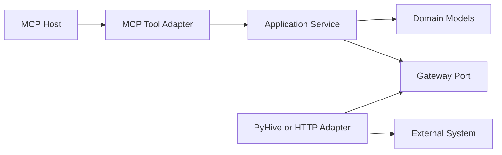
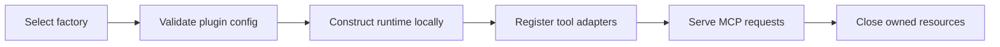

# Architecture and Modules

## Purpose and Authority

This document describes the package structure, module responsibilities, dependency direction, and extension rules for the plugin-based MCP stdio runtime.

The active OpenSpec proposal, specs, design, and tasks are the normative source of truth. This document is an explanatory architecture view and must be synchronized after approved OpenSpec changes.

The first deliverable slice (`deliver-hive-plugin-slice`) ships the Hive plugin and the shared runtime. Zeppelin and DolphinScheduler modules are described for reference but are deferred to separate follow-up changes; their registry loaders are placeholders that reject runtime construction until implemented.

## Architectural Style

The project is a modular monolith with vertical plugin slices and Clean Architecture dependency direction.



Dependencies point toward application and domain policy. External systems and MCP are adapters around the application core.

This is intentionally “Clean Architecture Lite”: responsibilities and import rules are strict, but v1 avoids a deeply nested directory for every conceptual layer.

## Process and Package Boundaries

There is one installable Python distribution and one `mcp-stdio` entry point. At runtime, each child process loads exactly one built-in plugin.

```text
One installed package
└── mcp-stdio entry point
├── process A: shared runtime + Hive plugin
├── process B: shared runtime + Zeppelin plugin        (deferred)
└── process C: shared runtime + DolphinScheduler plugin (deferred)
```

The package boundary simplifies installation and versioning. The process boundary isolates credentials, failures, connections, caches, and mutable state.

## Planned Source Layout

```text
src/mcp_stdio/
├── __init__.py
├── __main__.py
├── bootstrap.py
├── registry.py
│
├── core/
│   ├── config.py
│   ├── errors.py
│   ├── logging.py
│   └── server.py
│
├── contracts/
│   └── plugin.py
│
└── plugins/
    ├── hive/
    │   ├── plugin.py
    │   ├── config.py
    │   ├── models.py
    │   ├── service.py
    │   ├── gateway.py
    │   ├── pyhive.py
    │   └── tools.py
    ├── zeppelin/
    │   ├── plugin.py
    │   ├── config.py
    │   ├── models.py
    │   ├── service.py
    │   ├── gateway.py
    │   ├── http_client.py
    │   └── tools.py
    └── dolphinscheduler/
        ├── plugin.py
        ├── config.py
        ├── service.py
        ├── gateway.py
        ├── http_client.py
        └── tools.py
```

Files may become subpackages when they grow, but their responsibility and dependency direction must remain unchanged.

## Shared Runtime Modules

| Module | Responsibility | Allowed dependencies | Must not know about |
| --- | --- | --- | --- |
| `__main__.py` | Console entry point; delegates to bootstrap | `bootstrap` | Backend APIs and business behavior |
| `bootstrap.py` | CLI parsing, composition, lifecycle, cleanup | `core`, `contracts`, `registry`, MCP SDK | PyHive statements or REST endpoint details |
| `registry.py` | Explicit mapping of fixed plugin names to factories | Concrete `plugin.py` modules | Dynamic module names or filesystem discovery |
| `core/config.py` | Safe YAML/JSON loading (optional file), versioning, env-var-only startup, prefix overrides, secret references | Standard library, Pydantic, PyYAML | Plugin tool behavior or network clients |
| `core/errors.py` | Stable safe error categories and correlation metadata | Standard library/domain types | Raw backend-specific responses |
| `core/logging.py` | stderr logging and redaction | Standard library | MCP stdout writing |
| `core/server.py` | FastMCP stdio lifecycle and boundary error conversion | MCP SDK, plugin contract | Concrete backend adapters |
| `contracts/plugin.py` | Minimal plugin construction, registration, and cleanup protocol | Shared types only | Hive, Zeppelin, or DolphinScheduler details |

## Plugin Module Pattern

Every plugin follows the same responsibility pattern without sharing backend-specific abstractions.

| Module | Clean Architecture role | Responsibility |
| --- | --- | --- |
| `plugin.py` | Composition root | Validate plugin config, construct adapter/service, register tools, close resources |
| `config.py` | Boundary model | Define non-secret settings and secret references for that backend |
| `models.py` | Domain | Represent normalized requests, results, states, and metadata |
| `service.py` | Application | Implement use cases using gateway interfaces and domain models |
| `gateway.py` | Outbound port | Define the operations the application needs from the backend |
| `pyhive.py` / `http_client.py` | Outbound adapter | Translate the gateway operations to PyHive or REST calls |
| `tools.py` | Inbound adapter | Define MCP tool schemas and convert between MCP values and application models |

The plugin contract governs lifecycle only. It does not create a generic database or REST abstraction. Each backend keeps its own gateway vocabulary.

## Dependency Rules

### Allowed

```text
__main__ -> bootstrap
bootstrap -> core + contracts + registry
registry -> plugins.<name>.plugin
plugins.<name>.plugin -> plugin-local modules + contracts
plugins.<name>.tools -> plugin service + domain models + MCP SDK
plugins.<name>.service -> plugin gateway + domain models
plugins.<name>.external_adapter -> plugin gateway + external library
```

### Forbidden

```text
core -> plugins
service -> FastMCP
service -> PyHive
service -> httpx
hive -> zeppelin or dolphinscheduler
zeppelin -> hive or dolphinscheduler
dolphinscheduler -> hive or zeppelin
caller-controlled name -> importlib import
```

Architecture tests must scan imports and fail when these boundaries are violated.

## Plugin Lifecycle Contract

The minimal contract supports these phases:



A plugin provides:

- a canonical fixed name;
- plugin-specific configuration validation;
- construction of gateway adapter and application service;
- registration of its exact MCP tool set;
- idempotent asynchronous cleanup.

The contract does not support dynamic installation, hot reload, cross-plugin calls, or loading multiple plugins into one server.

## Hive Module Responsibilities

- `config.py` models binary Thrift/LDAP settings and cache TTL.
- `models.py` contains database, table, column, partition-column, and schema results.
- `service.py` implements list-database, list-table, and get-schema use cases plus cache coordination.
- `gateway.py` exposes only fixed metadata operations; it has no execute-SQL method.
- `pyhive.py` validates/quotes identifiers, generates approved statements, manages one connection per uncached call, and parses rows.
- `tools.py` exposes exactly three structured read-only MCP tools.

The cache is plugin-local. It may use shared generic utilities only if those utilities contain no Hive policy.

## Zeppelin Module Responsibilities

> **Deferred.** The Zeppelin plugin is not delivered by the Hive slice. The responsibilities below describe the planned shape for a follow-up change.

- `config.py` models base URL, authentication references, timeouts, result limits, and interpreter allowlist.
- `models.py` contains notebook IDs, paragraph IDs, normalized states, bounded outputs, and safe failures.
- `service.py` enforces use-case sequencing and interpreter authorization.
- `gateway.py` describes notebook creation, paragraph creation, execution, status, and result retrieval.
- `http_client.py` owns authentication/session state, URL encoding, REST translation, response bounds, and cleanup.
- `tools.py` exposes exactly the five approved notebook lifecycle tools.

Interpreter authorization belongs in application policy so it is enforced before the external adapter receives paragraph content.

## DolphinScheduler Module Responsibilities

> **Deferred.** The DolphinScheduler plugin is not delivered by the Hive slice. The responsibilities below describe the planned shape for a follow-up change.

- `config.py` models base URL, fixed status path, authentication references, and timeout.
- `service.py` implements only server-status inspection.
- `gateway.py` exposes one status operation and no generic HTTP method.
- `http_client.py` calls the configured status endpoint and normalizes bounded safe fields.
- `tools.py` registers only `get_server_status`.

The configured status path is deployment input, not MCP caller input.

## Cross-Cutting Policies

### Configuration

Shared configuration code handles the optional file format, version, unknown-field rejection, environment-variable-only startup, prefix overrides (`<PREFIX>_<FIELD>`), generic overrides (`MCP_STDIO__SETTINGS__<FIELD>`), and secret references. Environment variables take precedence over file values. Each plugin owns its settings schema and declares its prefix. Configuration validation makes no network requests.

### Errors

External adapters convert transport-specific failures into plugin/domain failures. The MCP boundary converts those failures into the stable shared error categories and redacts unsafe details.

### Logging

Only `core/logging.py` configures application logging. Logs go to stderr. Modules receive or obtain named loggers but do not configure stdout handlers.

### Concurrency

REST adapters use asynchronous HTTP clients. Synchronous PyHive calls run in worker threads. Mutable sessions are not shared across processes, and Hive sessions are not shared across concurrent calls.

### Dependency management

uv manages the Python 3.10+ project and committed lockfile. A package imported directly by project code must be declared directly in `pyproject.toml`.

## Testing Boundaries

```text
Application unit tests
  -> fake gateway; no MCP or upstream client

Adapter tests
  -> fake PyHive cursor/connection or HTTP mock transport

MCP contract tests
  -> real tool registration and serialization; fake application gateway

Subprocess smoke tests
  -> real mcp-stdio stdin/stdout lifecycle

Opt-in integration tests
  -> explicitly configured real backend
```

Required structural checks include:

- shared core has no concrete plugin imports;
- application services import no MCP or external client libraries;
- plugins do not import one another;
- the registry contains only approved built-in names;
- each plugin registers its exact approved tool set.

## Adding Future Behavior

New tools, authentication modes, transports, third-party plugins, or generic endpoint/query features require a new or updated OpenSpec change before code is modified. The change must update capability specs first, then this document if module boundaries or dependency direction change.
