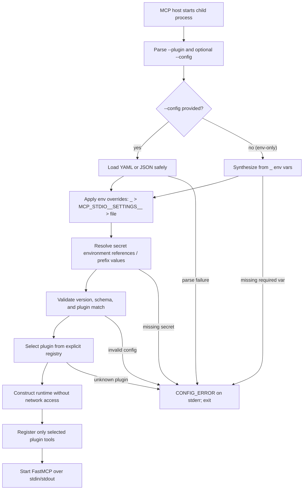
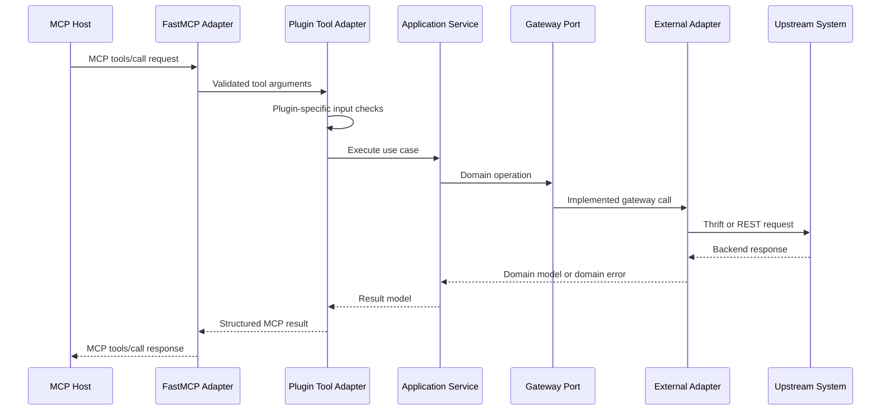
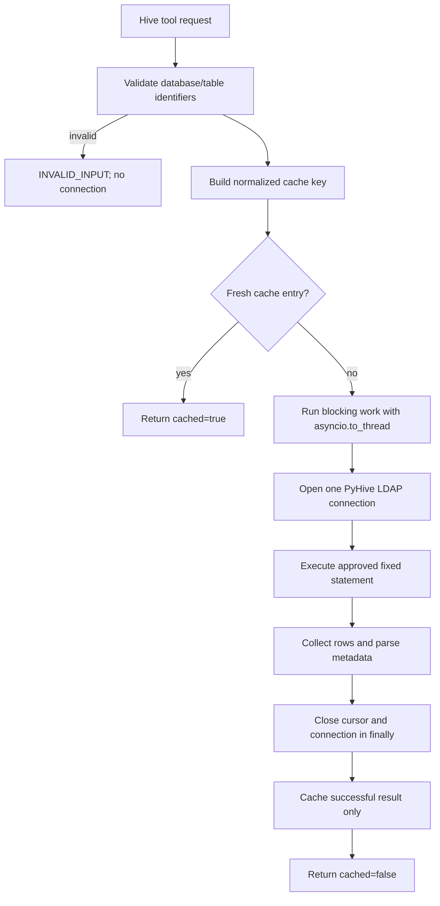
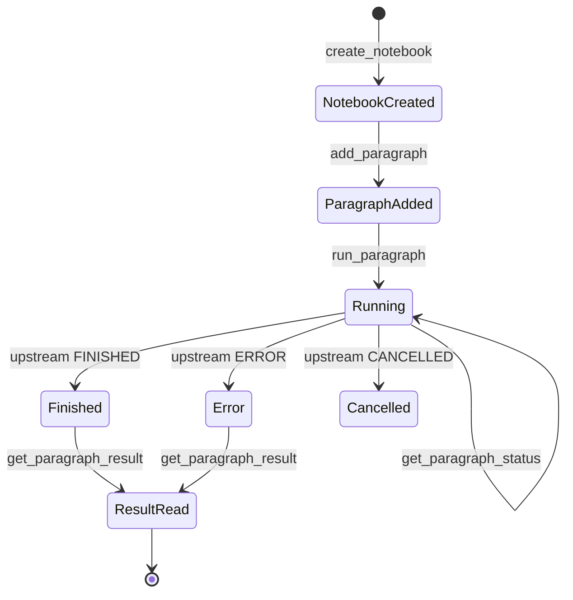
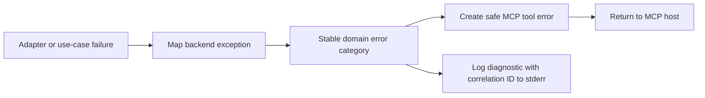

# MCP stdio Runtime Flow

## Purpose and Authority

This document explains how the plugin-based MCP stdio runtime starts, handles requests, reaches upstream systems, reports failures, and shuts down.

The active OpenSpec change remains normative:

- `openspec/changes/support-env-var-configuration/` (configuration source and precedence)
- `openspec/specs/plugin-stdio-runtime/spec.md` (synced main spec)
- `openspec/changes/build-plugin-mcp-stdio/` (multi-plugin runtime, partially deferred)

If this document differs from an active OpenSpec artifact, update the OpenSpec artifact first and then synchronize this explanation.

## Process Topology

The MCP host launches one child process for every configured plugin instance. `core` and `contracts` are Python modules loaded inside each child process; they are not separate services.

```text
MCP Host
│
├── mcp-stdio --plugin hive [--config hive.yaml]   # --config optional; HIVE_* env vars may supply everything
│     └── Hive plugin ── PyHive/Thrift/LDAP ── HiveServer2
│
├── mcp-stdio --plugin zeppelin --config zeppelin.yaml   (deferred)
│     └── Zeppelin plugin ── REST ── Zeppelin Server      (deferred)
│
└── mcp-stdio --plugin dolphinscheduler --config dolphinscheduler.json   (deferred)
      └── DolphinScheduler plugin ── REST ── DolphinScheduler             (deferred)
```

Every child process has its own stdin/stdout MCP channel, configuration, secrets, clients, caches, failures, and shutdown lifecycle. Processes share installed package files only.

The first deliverable slice (`deliver-hive-plugin-slice`) ships the Hive plugin and the shared runtime it depends on. The Zeppelin and DolphinScheduler processes shown above are deferred to separate follow-up changes; their registry loaders exist as placeholders that reject runtime construction until implemented.

## Startup Flow



Startup validation is local. An unreachable HiveServer2 or REST server does not prevent the MCP process from starting; the first tool call that needs the backend reports the connection failure.

### Startup invariants

- No plugin is imported from caller-controlled module text.
- Plugin import and runtime construction perform no network request.
- The CLI plugin and configuration plugin must match.
- Unknown configuration fields fail closed.
- Secret fields contain environment variable names, not credential values.
- stdout remains reserved for MCP protocol messages.

## Common Tool Request Flow



The application service does not know about FastMCP, PyHive, or HTTP. It works with domain models and gateway interfaces, which allows unit tests to use fake gateways.

## Hive Request Flow

Hive is metadata-only. It never accepts SQL text from the MCP caller.



Approved statement families are `SHOW DATABASES`, `SHOW TABLES`, `DESCRIBE`, and optional `SHOW CREATE TABLE`. Each uncached invocation owns one connection; concurrent requests do not share a Hive session.

## Zeppelin Request Flow

Zeppelin is execution-capable and therefore has a stricter trust boundary. The Zeppelin plugin is **deferred** to a follow-up change; the flow below describes the planned behavior for reference.



`add_paragraph` validates the requested interpreter before sending paragraph content upstream. The default interpreter allowlist is empty. `run_paragraph` starts execution and returns promptly; it does not poll until completion. The MCP client controls polling through `get_paragraph_status`, then retrieves bounded output with `get_paragraph_result`.

Opaque notebook and paragraph IDs are size-checked and URL-encoded. Large output is truncated to the configured limit and marked with `truncated: true`.

## DolphinScheduler Request Flow

The v1 DolphinScheduler plugin exposes only `get_server_status`. This plugin is **deferred** to a follow-up change; the flow below describes the planned behavior for reference.

```text
get_server_status
  -> read configured base URL and status path
  -> attach environment-backed authentication internally
  -> call the fixed configured endpoint
  -> normalize availability, status, version, and safe details
  -> discard raw headers, cookies, tokens, and unbounded bodies
```

The MCP caller cannot select an HTTP method, URL, path, headers, or body. Workflow operations are not registered.

## Error Flow



Stable categories are:

- `CONFIG_ERROR`
- `INVALID_INPUT`
- `AUTHENTICATION_FAILED`
- `PERMISSION_DENIED`
- `NOT_FOUND`
- `CONNECTION_FAILED`
- `TIMEOUT`
- `UPSTREAM_ERROR`
- `UNEXPECTED_RESPONSE`

Returned errors may contain an operation, safe object identifiers, retryability, and a correlation ID. They must not contain credentials, authorization headers, cookies, raw client objects, stack traces, or unbounded upstream bodies.

## Shutdown Flow

Shutdown starts when stdin reaches EOF, the MCP session is cancelled, startup fails after resource creation, or the host terminates the child process normally.

```text
Stop accepting MCP work
  -> allow the active request to finish or cancel it
  -> close plugin-owned HTTP client/session state
  -> close any active cursor/connection in its existing finally path
  -> flush redacted stderr logs
  -> exit child process
```

Stopping one plugin process has no effect on other independently launched plugin processes.

## Runtime Verification

The implementation must provide automated evidence for:

- exact tool sets per plugin;
- no network access during configuration validation;
- protocol-only stdout and logs on stderr;
- secret-safe errors through the actual MCP serialization path;
- cleanup on success, failure, cancellation, and EOF;
- Hive connection isolation and cache behavior;
- subprocess startup and shutdown behavior.

Zeppelin interpreter denial and DolphinScheduler status-only access are required only once those deferred plugins ship.
